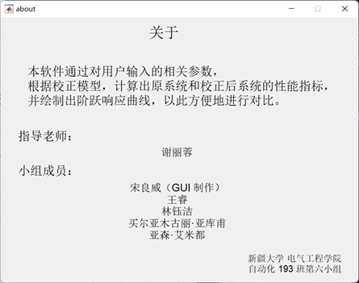
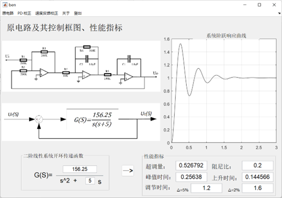
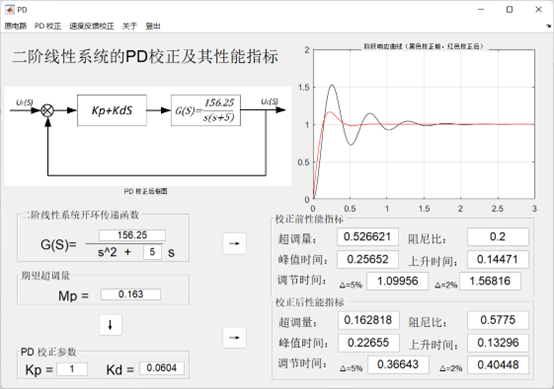
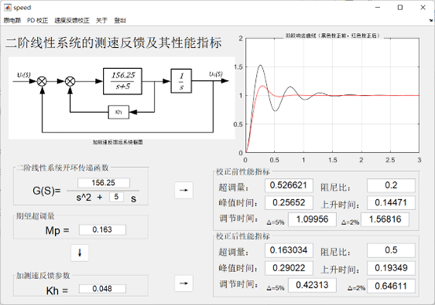

# 线性定常系统仿真研究
## 实习（实训）要求
1. 根据系统模拟电路，推导出系统传递函数，计算系统动态性能指标（理论计算）；
2. 设计比例微分控制校正装置，使校正后系统的超调量 MP =16.3%（理论设计）；
3. 设计测速反馈校正装置，使校正后系统的超调量 MP =16.3%（理论设计）；
4. 利用 MATLAB 2016a 建立仿真模型，比较比例微分控制和测速反馈对反应速度和稳态精度的影响；
5. 写出设计过程及结果，并总结比例微分控制和测速反馈对反应速度和稳态精度的影响；
6. 利用 MATLAB 2016a 设计开发GUI软件（本人主要任务）

## GUI 说明书
### 登录界面
打开应用程序（运行 login.m），进入软件主菜单界面：

“关于”菜单选项为本软件的简单介绍：

默认账号：123
默认密码：123
点击“退出”退出本软件，点击“登录”进入程序主界面。

### 主界面
主界面菜单有“原电路“即原电路及其性能指标、”PD校正“即二阶线性系统的比例-微分校正及其性能指标、”速度反馈校正“即二阶线性系统的测速反馈及其性能指标、”关于“与登录界面的”关于“菜单相同、”登出“即退出当前账号至登录界面。

#### 原电路
登录成功后进入此界面并自动载入示例系统及其性能指标，更改“二阶线性系统开环系统传递函数“中的参数后，点击右箭头按钮，可绘制出系统阶跃响应曲线，并在”性能指标“处显示当前系统的各项指标。

#### PD校正
在主界面菜单选项中选择“PD校正“后进入此界面，并自动载入示例系统及其性能指标。
更改“二阶线性系统开环系统传递函数“中的参数后，点击对应的右箭头按钮，可绘制出原系统阶跃响应曲线，并在”校正前性能指标“处显示当前系统的各项指标。
更改“期望超调量“中的参数后，点击对应的右箭头按钮或下箭头，可在”PD校正参数处“显示满足期望超调量的PD参数，在界面右侧可绘制出原系统与PD校正后系统阶跃响应曲线，并在”校正后性能指标“处显示校正后系统的各项指标。

#### 速度反馈校正
在主界面菜单选项中选择“速度反馈校正“后进入此界面，并自动载入示例系统及其性能指标。
更改“二阶线性系统开环系统传递函数“中的参数后，点击对应的右箭头按钮，可绘制出原系统阶跃响应曲线，并在”校正前性能指标“处显示当前系统的各项指标。
更改“期望超调量“中的参数后，点击对应的右箭头按钮或下箭头，可在”加测速反馈参数“处显示满足期望超调量的参数，在界面右侧可绘制出原系统与速度反馈校正后系统阶跃响应曲线，并在”校正后性能指标“处显示校正后系统的各项指标。

### 退出软件
点击主界面菜单选项“登出“，退出至登录界面，点击退出按钮退出本软件。