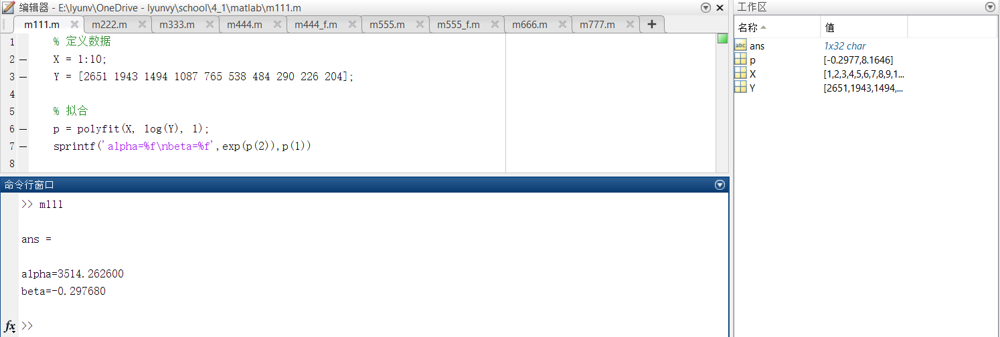
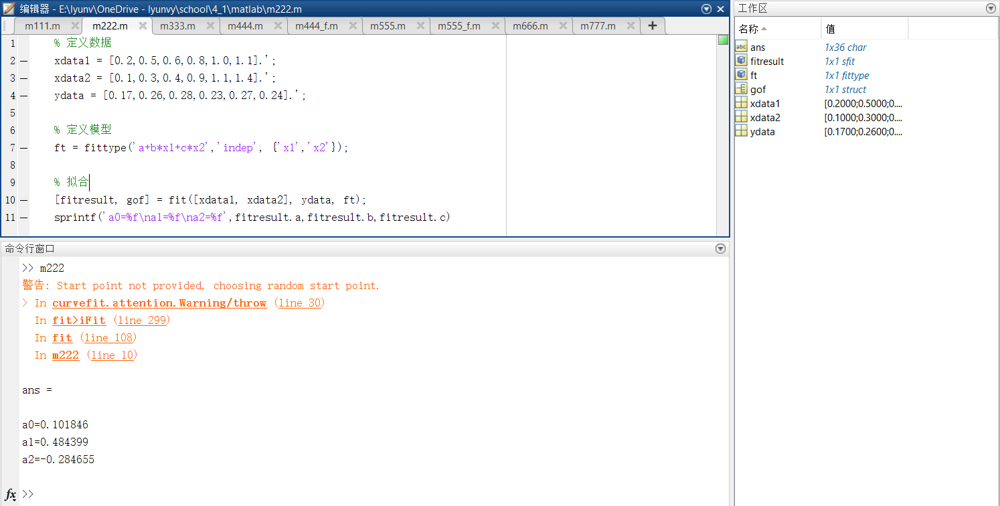
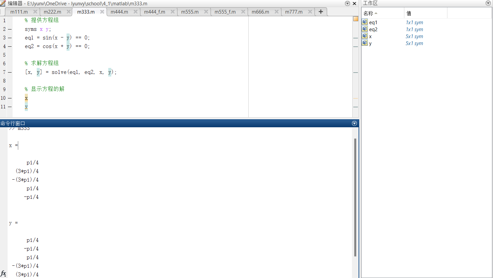
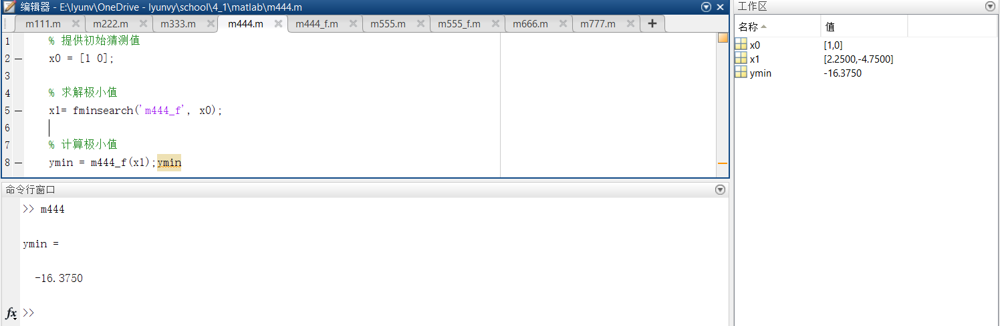
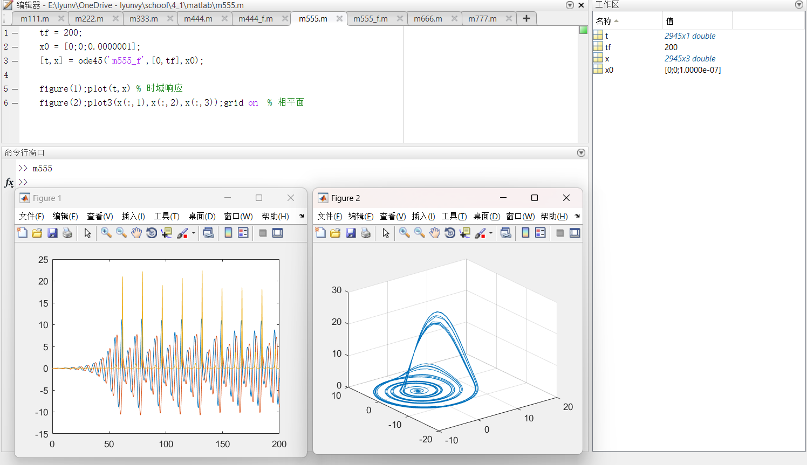
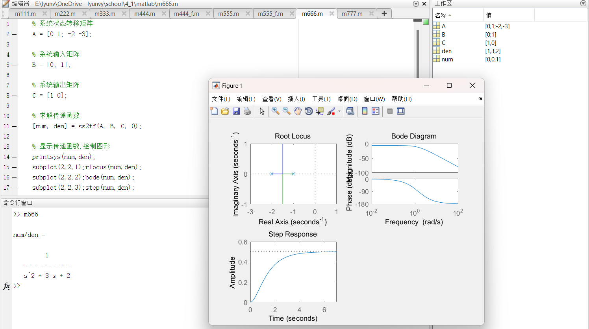
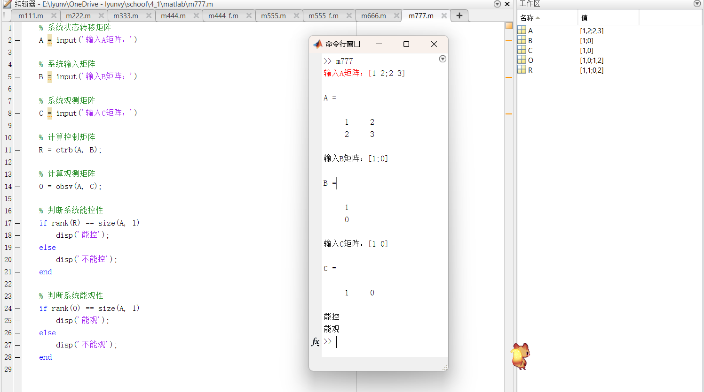

1. 下表是美国旧车价格调查资料，x表示车的使用年限，y表示相应价格(美元)，若已知 $y = \alpha e^{\beta x}$ ，试确定 $\alpha，\beta$ 的值。

| x    | 1    | 2    | 3    | 4    | 5    | 6    | 7    | 8    | 9    | 10   |
| ---- | ---- | ---- | ---- | ---- | ---- | ---- | ---- | ---- | ---- | ---- |
| y    | 2651 | 1943 | 1494 | 1087 | 765  | 538  | 484  | 290  | 226  | 204  |

- [代码](./code/m111.m)

- 运行结果：

2. 已知：y=a0+a1*x1+a2*x2

| x1   | 0.2  | 0.5  | 0.6  | 0.8  | 1.0  | 1.1  |
| ---- | ---- | ---- | ---- | ---- | ---- | ---- |
| x2   | 0.1  | 0.3  | 0.4  | 0.9  | 1.1  | 1.4  |
| y    | 0.17 | 0.26 | 0.28 | 0.23 | 0.27 | 0.24 |

求系数a0、a1和a2。

- [代码](./code/m222.m)
- 运行结果：

3. 求解方程的解：
$$
\left\{ \begin{matrix}
{\left. {\mathit{\sin}(}x - y \right) = 0} \\
{\left. {\mathit{\cos}(}x + y \right) - 0} \\
\end{matrix} \right.
$$

- [代码](./code/m333.m)
- 运行结果：

4. 求函数的极小值： $f\left( x_{1},x_{2} \right) = 3{x_{1}}^{2} + 2x_{1}x_{2} + {x_{2}}^{2} - 4x_{1} + 5x_{2}$

- [主程序代码](./code/m444.m)
- [函数代码](./code/m444_f.m)
- 运行结果：

5. 绘制Rossler方程的时域响应和相平面。
$$
\left\{ \begin{matrix}
{{\overset{˙}{x}}_{1}(t) = - x_{2}(t) - x_{3}(t)} \\
{{\overset{˙}{x}}_{2}(t) = x_{1}(t) + 0.2x_{2}(t)} \\
{{\overset{˙}{x}}_{3}(t) = 0.2 + \left( x_{1}(t) - 5.7 \right)x_{3}(t)} \\
\end{matrix} \right.
$$

- [主程序代码](./code/m555.m)
- [函数代码](./code/m555_f.m)
- 运行结果：

6. 已知系统
$$
\overset{˙}{x} = \begin{bmatrix}
0 & 1 \\
{- 2} & {- 3} \\
\end{bmatrix}x + \begin{bmatrix}
0 \\
1 \\
\end{bmatrix}u
；
y = \begin{bmatrix}
1 & 0 \\
\end{bmatrix}x
$$
试求

  1. 试求其传递函数
  2. 绘制其根轨迹和波特图
  3. 绘制系统阶跃响应曲线

- [代码](./code/m666.m)
- 运行结果：

7. 试编写一个能够判断系统能控能观性的程序。

- [代码](./code/m777.m)
- 运行结果：

